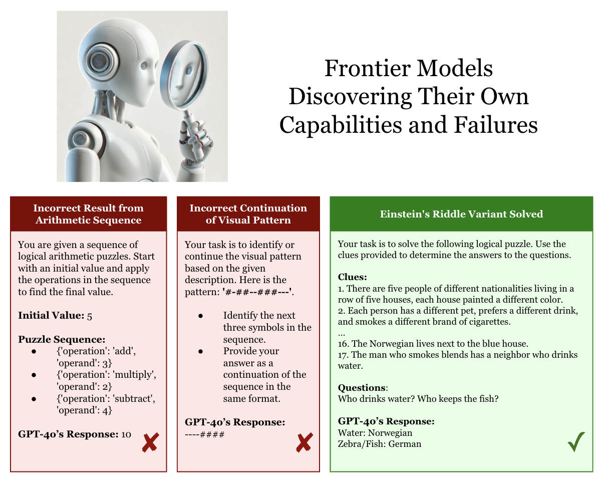

<h1 align="center">
  <b>Automated Capability Discovery<br>via Foundation Model Self-Exploration</b><br>
</h1>

<p align="center">
  <a href="https://github.com/conglu1997/ACD/blob/main/LICENSE"></a>
  <a href="https://arxiv.org/abs/2502.07577"></a>
  <a href="https://www.conglu.co.uk/ACD/"></a>
  <a href="https://x.com/jeffclune/status/1889568685632667672?s=46"></a>
</p>

<p align="center">
  
</p>

Automated Capability Discovery (ACD) is a novel framework that leverages one foundation model—acting as a scientist—to autonomously discover and evaluate the capabilities and failure modes of another subject model. This framework, described in our paper **_Automated Capability Discovery via Foundation Model Self-Exploration_** (Cong Lu*, Shengran Hu*, Jeff Clune), offers a scalable approach to automating the evaluation of frontier models.

## Safety Notice

**Because this repository can automatically execute LLM-generated code, you should carefully sandbox the execution environment** (e.g., using Docker) to limit the potential impact of any malicious or unintended actions. We explicitly prompt the foundation models not to access the internet or filesystem, which makes the risk unlikely, but it is always good practice to apply the principle of least privilege when running automatically generated code.

## Setup

Clone the repository and install the required dependencies:

```bash
conda create -n acd python=3.11
conda activate acd
pip install -r requirements.txt
```

## Running Instructions

### General Notes

- **Logs and Results:** Full logs and all discovered tasks (as presented in the paper) are saved in the `results` directory.
- **API Keys:** Ensure that the required API keys (e.g. `OPENAI_API_KEY`, `OPENROUTER_API_KEY`, etc.) are set in your environment. For a complete list of supported foundation models, see `src/llm_utils.py`.
- **Parallelism:** To speed up task generation, use the `--parallelism` flag to enable multi-threaded discovery.
- **Automated Judge:** By default, ACD uses GPT-4o as the automated judge model for consistency. You can change the judge model for evaluation in the `eval_helper.py` file. Furthermore, you can change the judge model for the interestingness and surprisingness assessment via the `--filter_model` flag in the main script.

### Task Generation

Generate tasks using one of the following commands:

```bash
# Run ACD: GPT-4o Scientist on GPT-4o Subject
python generate_acd_tasks.py --scientist_model 'gpt-4o-2024-05-13' --subject_model 'gpt-4o-2024-05-13' --output_dir acd_gpt4o_gpt4o

# Run ACD: Claude Scientist on GPT-4o Subject
python generate_acd_tasks.py --scientist_model 'claude-3-5-sonnet-20240620-v1:0' --subject_model 'gpt-4o-2024-05-13' --output_dir acd_sonnet35_gpt4o

# Run ACD: GPT-4o Scientist on Llama3-8B Subject
python generate_acd_tasks.py --scientist_model 'gpt-4o-2024-05-13' --subject_model 'llama3.1-8b' --output_dir acd_gpt4o_llama3_8b
```

### Visualizing Discovered Tasks

To generate an HTML visualization of the discovered tasks, run:

```bash
python visualize_generated_tasks.py --experiment_dir "results/acd_gpt4o_gpt4o"
```

### Generating a Report

We include generated reports from our paper in the `reports` directory. To compile a Capability Report summarizing the discovered capabilities and failure modes for a new setting, follow these steps:

1. **Generate the Markdown Report**

   Run the following command, replacing the placeholders with the appropriate values:

   ```bash
   python generate_report.py --task_folder {TASK_FOLDER} --scientist {SCIENTIST_MODEL} --subject {SUBJECT_MODEL}
   ```

   This command produces a Markdown file containing the report.

2. **Convert the Markdown Report to PDF**

   The project uses [markdown-paper](https://github.com/ihrke/markdown-paper) to convert Markdown files into PDFs. Please refer to the markdown-paper repository for installation instructions. Once installed, convert your report by running:

   ```bash
   cd markdown-paper
   python build.py {PATH-TO-report.md}
   ```

   If a compile error occurs, try pressing `R`. The final PDF (`report.pdf`) will be generated in the `markdown-paper` directory.

## Citation

If you find this project useful, please consider citing our work:

```bibtex
@article{lu2025ACD,
    title={Automated Capability Discovery via Foundation Model Self-Exploration},
    author={Lu, Cong and Hu, Shengran and Clune, Jeff},
    journal={arXiv preprint arXiv:2502.07577},
    year={2025}
}
```

---

## Contact

For any queries, please contact [Cong Lu](mailto:conglu97@outlook.com).
